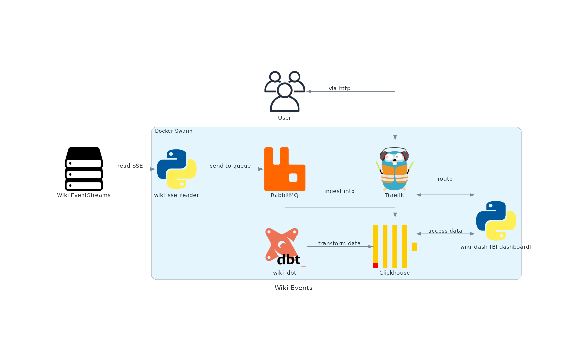

# wiki-events

System that consumes data from [Wikipedia EventStreams](https://wikitech.wikimedia.org/wiki/Event_Platform/EventStreams) service and exposes analytics dashboard with insights about activity on different wikipedia instances. See:

- [Architecture](#architecture) section for tech details,
- [Deployment](deploy.md) for instructions on running the code,
- [Screenshot](screenshot.md) for overview of ready dashboard.

Project submitted for [Data Engineering Zoomcamp 2024](https://github.com/DataTalksClub/data-engineering-zoomcamp).

## Architecture

Guiding principles of tech choices:

- avoiding vendor lock in,
- preferring lightweight tools without redudant features,
- configuration kept in repo.

This repo contains example [terraform](terraform) config for [Deployment](deploy.md) using _Hetzner Cloud_ but in principle everything can work on _any_ linux server, hosted _anywhere_. Also, no proprietary tools are used.

### Components

| Component | Description |
| --- | --- |
| [wiki_sse_reader](wiki_sse_reader) | Python service reading _Server-sent events_ from wikipedia source |
| [wiki_dbt](wiki_dbt) | Models (i.e. SQL code) for transforming data within database |
| [wiki_dash](wiki_dash) | BI dashboard app defined in Python ([Dash](https://github.com/plotly/dash)) |
| [RabbitMQ](https://github.com/rabbitmq/rabbitmq-server) | Message queue that handles events |
| [Clickhouse](https://github.com/ClickHouse/ClickHouse) | Main OLAP database to store data and run analytics queries |

### Diagram

### DB tables

| table | level (medallion architecture) | description |
| --- | --- | --- |
| wiki_raw | bronze | Raw ingested wiki data |
| wiki | silver | Parsed and filtered wiki data |
| wiki_minutely_summary | gold | Event count by minute (total) |
| wiki_hourly_summary | gold | Event count by hour (total) |
| wiki_minutely_bywiki_summary | gold | Event count by minute (by wiki) |
| wiki_hourly_bywiki_summary | gold | Event count by hour (by wiki) |
| wiki_weekdays_summary | gold | Average event count for specific times of the week |
| wiki_bywiki_summary | gold | Total event counts by wiki |
